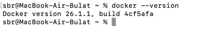
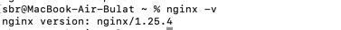

# Развертывание на сервер

##  Подготовка

### Backend Django Rest Framework

1. Настройка файла `settings.py`.
   ```python
   # выключить для продакшена
   DEBUG = False
   
   # разрешенные домены
   # пример:
   ALLOWED_HOSTS = ['example.com', 'www.example.com']
   
   # настройка cors
   # пример:
   CORS_ALLOWED_ORIGINS = [
       "https://example.com",
       "https://www.example.com",
   ]
   CORS_ALLOWED_METHODS = [
       "OPTIONS",  # Разрешение метода OPTIONS
       "GET",  # Разрешение метода GET
       "POST",  # Разрешение метода POST
       "PUT",  # Разрешение метода PUT
       "PATCH",  # Разрешение метода PATCH
       "DELETE",  # Разрешение метода DELETE
   ]
   
   CORS_ALLOWED_HEADERS = [
      "Authorization",  # Разрешение заголовка Authorization
      "Content-Type",   # Разрешение заголовка Content-Type
   ]
   
   # настройка csrf
   CSRF_TRUSTED_ORIGINS = [
       "https://example.com",
       "https://www.example.com",
   ]
   CSRF_COOKIE_SECURE = True # если необходимо использовать https
    
   # настройка ssl при необходимости
   SECURE_HSTS_SECONDS = 31536000  # 1 год в секундах
   SECURE_SSL_REDIRECT = True
   
   # настройка куки
   SESSION_COOKIE_SECURE = True # если необходимо использовать https
   ```

2. Настройка urls.py
    
    ```python
    urlpatterns = [
        path('api/', include('api.urls')),
    ]
    ```

3. Настройка gunicorn / uvicorn / daphne.
   
   - gunicorn:
      
      - Установка gunicorn:
         ```bash
         python -m pip install gunicorn
         ```
         
      - Запуск gunicorn:
         ```bash
         gunicorn myproject.wsgi:application --bind 0.0.0.0:8000
         ```
        
   - uvicorn:
      
      - Установка uvicorn:
         ```bash
         python -m pip install uvicorn
         ```
        
      - Запуск uvicorn:
         ```bash
         python -m uvicorn myproject.asgi:application --reload --host 0.0.0.0 --port 8000
         ```
   
   - daphne:
     
     - Установка daphne:
       ```bash
       python -m pip install daphne
       ```
       
     - Запуск daphne:
       ```bash
       daphne -b 0.0.0.0 -p 8000 myproject.asgi:application
       ```
       
4. Настройка образа веб-приложения:
    
    Пример:
    ```dockerfile
    FROM python:3.12-slim
    ENV PYTHONBUFFERED=1
    
    RUN apt-get update && apt-get install -y \
        locales
    RUN dpkg-reconfigure locales
    
    RUN pip install poetry
    
    WORKDIR /app
    
    COPY . /app
    
    RUN poetry install
    
    RUN poetry run python manage.py collectstatic --noinput --clear
    ```
    Также могут использоваться другие образы, зависит от особенностей проекта.

5. Настройка конфигурационного файла `docker-compose.yml`.
   
   Пример:
    ```yaml
    version: '3.8'

    services:
      db:
        image: postgres:14.1-alpine
        restart: always
        container_name: pgdb
        ports:
          - 5432:5432
        environment:
          POSTGRES_DB: example
          POSTGRES_USER: example
          POSTGRES_PASSWORD: example
        volumes:
          - db:/var/lib/postgresql/data
        networks:
          - example
    
      redis:
        image: redis:6-alpine
        container_name: redis
        ports:
          - 6379:6379
        networks:
          - example
    
      backend:
        tty: true
        build: ..
        command: sh -c "poetry run python manage.py migrate &&
          poetry run daphne -b 0.0.0.0 -p 8000 myproject.asgi:application"
        restart: always
        volumes:
          - .:/app
        ports:
          - "8000:8000"
        depends_on:
          - db
        container_name: django
        environment:
          DB_NAME: example
          DB_USER: example
          DB_PASS: example
          DB_PORT: 5432
          DJANGO_SETTINGS_MODULE: myproject.settings
        networks:
          - example
    volumes:
      db:
    networks:
      example:
        driver: bridge
    ```

### Frontend 

1. Настройка образа:
    
    Пример:
    ```dockerfile
    FROM node:22-alpine

    WORKDIR /app
    
    COPY package*.json ./
    
    RUN npm install
    
    COPY . .
    
    CMD [ "npm", "run", "prod" ]
    ```

2. Настройка конфигурационного файла `docker-compose.yml`.
   
   Пример:
    ```yaml
    version: '3'
    services:
      frontend:
        container_name: vue
        restart: on-failure
        build:
          context: ..
          dockerfile: Dockerfile
        ports:
          - "5173:5173"
        volumes:
          - .:/app
          - /app/node_modules
        networks:
          - exapmle
    
    networks:
      vue-exapmle:
        driver: bridge
    ```

3. Надо указать базовый url для backend:
    
    ```vue
    baseURL: "https://example.com/api",
    ```

##  Развертывание на сервер

1. Необходимо установить docker и docker-compose.

    - Проверка docker:
      

    - Проверка docker-compose:
      

2. Необходимо установить nginx.
    
    - Проверка nginx:
      

    - Прописать конфигурацию nginx:
      ```bash
      sudo nano /etc/nginx/sites-available/my-site
      ```
      
      Пример:
      ```nginx
      server {
        server_name giplatform.ru www.giplatform.ru;
    
        location / {
          proxy_pass http://127.0.0.1:5173;
          proxy_set_header Host $host;
          proxy_set_header X-Real-IP $remote_addr;
          proxy_set_header X-Forwarded-For $proxy_add_x_forwarded_for;
          proxy_set_header X-Forwarded-Proto $scheme;
        }
    
        location /api/ {
          proxy_pass http://127.0.0.1:8000;
          proxy_set_header Host $host;
          proxy_set_header X-Real-IP $remote_addr;
          proxy_set_header X-Forwarded-For $proxy_add_x_forwarded_for;
          proxy_set_header X-Forwarded-Proto $scheme;
       }

      }
      ```
    
    - Переместить конфигурацию nginx:
      ```bash
      sudo ln -s /etc/nginx/sites-available/my-site /etc/nginx/sites-enabled/my-site
      ```
      
    - Перезапустить nginx:
      ```bash
      sudo systemctl restart nginx
      ```
    
    - 

3. Необходимо установить certbot.
    
    - Установка сертификата certbot:
      
      ```bash
      sudo apt-get install certbot
      ```
    
      ```bash
      certbot --nginx -d example.com -d www.example.com
      ```

4. По итогу должнен получиться такой конфигурационный файл:
    
    ```nginx
    server {
    server_name example.com www.example.com;

    location / {
        proxy_pass http://127.0.0.1:5173;
        proxy_set_header Host $host;
        proxy_set_header X-Real-IP $remote_addr;
        proxy_set_header X-Forwarded-For $proxy_add_x_forwarded_for;
        proxy_set_header X-Forwarded-Proto $scheme;
    }

    location /api/ {
        proxy_pass http://127.0.0.1:8000;
        proxy_set_header Host $host;
        proxy_set_header X-Real-IP $remote_addr;
        proxy_set_header X-Forwarded-For $proxy_add_x_forwarded_for;
        proxy_set_header X-Forwarded-Proto $scheme;
    }

    location /ratios/ {
        proxy_pass http://127.0.0.1:8001;
        proxy_set_header Host $host;
        proxy_set_header X-Real-IP $remote_addr;
        proxy_set_header X-Forwarded-For $proxy_add_x_forwarded_for;
        proxy_set_header X-Forwarded-Proto $scheme;
    }


    listen 443 ssl; # managed by Certbot
    ssl_certificate /etc/letsencrypt/live/giplatform.ru/fullchain.pem; # managed by Certbot
    ssl_certificate_key /etc/letsencrypt/live/giplatform.ru/privkey.pem; # managed by Certbot
    include /etc/letsencrypt/options-ssl-nginx.conf; # managed by Certbot
    ssl_dhparam /etc/letsencrypt/ssl-dhparams.pem; # managed by Certbot
    }
    server {
        if ($host = www.example.com) {
            return 301 https://$host$request_uri;
        } # managed by Certbot
    
    
        if ($host = example.com) {
            return 301 https://$host$request_uri;
        } # managed by Certbot
    
    
        listen 80;
        server_name example.com www.example.com;
        return 404; # managed by Certbot
    
    }
    ```

5. Необходимо клонировать backend и frontend из github / gitlab.
   
   ```bash
   git clone https://github.com/examplebackend.git
   ```
   
   ```bash
   git clone https://github.com/example/frontend.git
   ```

6. Необходимо собрать и запустить контейнеры backend и frontend.
    
    ```bash
    docker-compose up -d --build
    ```